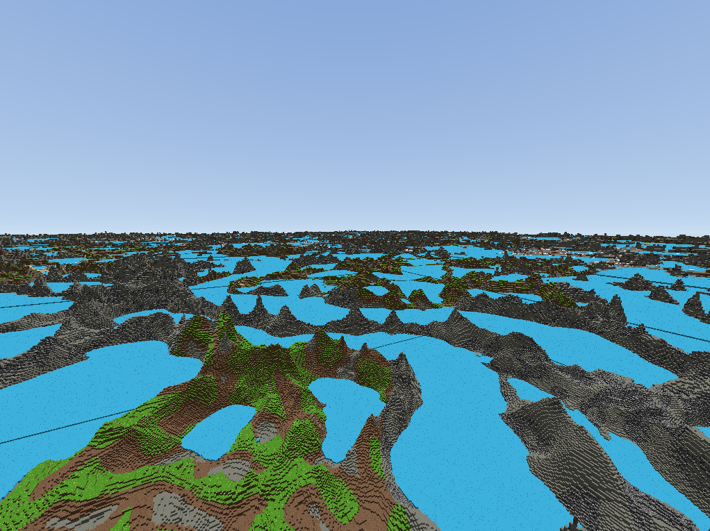
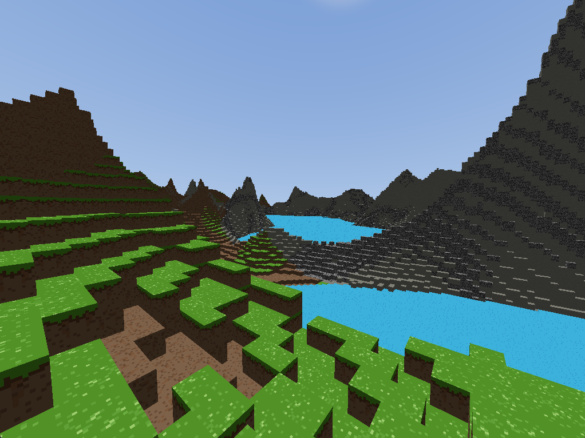

# Manifold

A from-scratch voxel engine built with **Rust** and **Vulkan**, mainly built for VR.





## Features

**Rendering**

**Terrain generation**

**World**

## Architecture

```
src/
  graphical_core/   Vulkan renderer, pipelines, GPU pools, command recording
  voxel/            Chunks, terrain, biomes
  storage/          Region files, world metadata, disk caching
  vr/               OpenXR session, stereo swapchains, multiview
  shaders/          GLSL mesh/task/vertex/fragment/compute shaders (SPIR-V)
```

Voxel data and rendering are decoupled. Terrain generation runs on background thread pools (crossbeam channels). Three independent GPU pools manage near-field mesh chunks, SVDAG ray march data, and heightmap tile geometry.

## Build

Requires the [Vulkan SDK](https://vulkan.lunarg.com/) and `glslc` on PATH.

```
cargo run --release
```

## Controls

| Key | Action |
|-----|--------|
| WASD | Move |
| Mouse | Look |
| Space | Jump (walk mode) |
| Shift | Fast fly |
| E / Q | Fly up / down |
| F | Toggle fly/walk |
| Left click | Break block |
| Right click | Place block |
| Esc | Release cursor |
